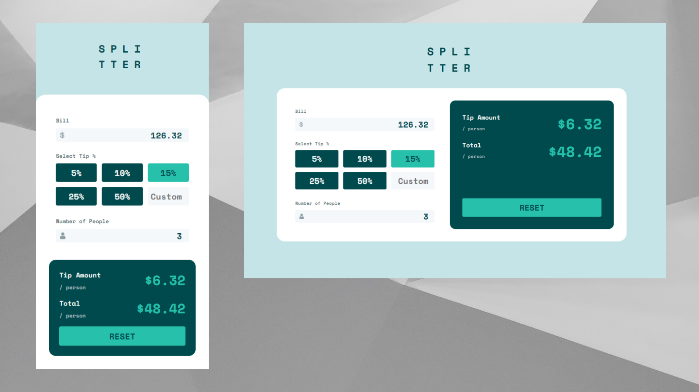

# Frontend Mentor - Tip calculator app solution

This is a solution to the [Tip calculator app challenge on Frontend Mentor](https://www.frontendmentor.io/challenges/tip-calculator-app-ugJNGbJUX).

## Table of contents

- [Overview](#overview)
  - [The challenge](#the-challenge)
  - [Screenshot](#screenshot)
  - [Links](#links)
- [My process](#my-process)
  - [Built with](#built-with)
  - [What I learned](#what-i-learned)
  - [Continued development](#continued-development)
- [Author](#author)

## Overview

### The challenge

Users should be able to:

- View the optimal layout for the app depending on their device's screen size
- See hover states for all interactive elements on the page
- Calculate the correct tip and total cost of the bill per person
- Be warned of invalid input
- Use the app with mouse, touch, keyboard and screen reader

### Screenshot

Background Image by <a href="https://unsplash.com/@shapelined?utm_source=unsplash&utm_medium=referral&utm_content=creditCopyText">Shapelined</a> on <a href="https://unsplash.com/s/photos/abstract-background?utm_source=unsplash&utm_medium=referral&utm_content=creditCopyText">Unsplash</a>

### Links

- Solution URL: [Add solution URL here](https://your-solution-url.com)
- Live Site URL: http://tip-calculator-navy.vercel.app/

## My process

### Built with

- Typescript
- [React](https://reactjs.org/)
- [Next.js](https://nextjs.org/)
- [Vanilla Extract](https://vanilla-extract.style/)
- [React Hook Form](https://react-hook-form.com/)

### What I learned

There were a few things I wanted to work on with this exercise

#### Design System

I wanted to try creating a small design system that I could use for this app. And that would hopefully be re-usable for building other things in future. Doing this upfront work certainly meant that the build took a lot longer than just using bespoke styles, but I think it was time well spent. I learned a lot about putting together suitable re-usable components at the right level of abstraction. I took heavily from the design primitives illustrated in https://every-layout.dev/ and I implemented everything using https://vanilla-extract.style/ to leverage CSS Custom Properties in a Typescript environment.

I am particularly happy with some of the DX touches here including an automatically switching `<Text/>` component that will change text color based on whether it's rendered in a light or dark context. This is not just the case of having an overal dark or light theme, but a dark box in a light theme, must still have light text, so it's visible. I took inspiration from the [Braid design system](https://seek-oss.github.io/braid-design-system/) for this API.

#### Form Logic and Validation

At first glance the logic for this app seems quite simple. It takes some input and performs some multiplication and division to show an output. But on digging further into the requiements things become more complex.

- The final output should only be calculated if the user has filled everything in
- The bill and number of people must be greater than zero
- The custom tip can be zero
- The preset tip should be cleared if a custom tip is entered and vice versa
- Validation warnings should only show after a user has interacted with a field
- The reset button should only be active if the form is dirty

I initially implemented all this logic in a hand-rolled reducer function, but the logic became difficult to read. I wanted to separate out the validation logic into its own function but that made managing the overall state of the form difficult. I felt this logic would prove difficult to maintain in the long term, so I chose to refactor using [React Hook Form](https://react-hook-form.com/). This allowed me to remove dozens of lines of code, and encapsulates the validation logic in a robust library. That just left the custom buiness logic of how to calculate the tip, making the component much easier to reason about.

This was not the first time I've used React Hook Form, but it was the first time I did so using controlled inputs. That was an interesting challenge, but I think successful, and will be easier to use again on new projects.

### Continued development

I'd like to try and use some of the design system components I've created on new projects. This will be a good test for how reusable and composable the api is. If that's successful I may pacakge it up as an NPM package so I can more easily share it between my projects

## Author

- Website - [Alex Marshall](https://github.com/AlexKMarshall)
- Frontend Mentor - [@AlexKMarshall](https://www.frontendmentor.io/profile/AlexKMarshall)
- Twitter - [@AlexKMarshall1](https://twitter.com/alexkmarshall1)
